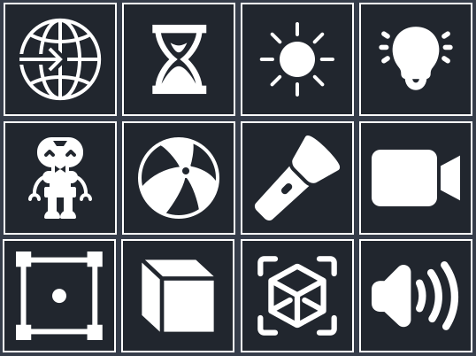

# Godot Quick 3D Toolbar

## About
Quick toolbar is a simple plugin for Godot that allows you to quickly create 3D nodes in your projects using a shortcut bar.

## How to install
Copy "quick_toolbar" folder inside the "addons" folder of your Godot project and activate the plugin in the project settings.

## How to use it
Just click on the node icon to instantiate it in the current scene.

## PARA SUBIR A GITHUB
Ir a la carpeta de res://

Click derecho en espacio vacio y abrir el git bash

Crear un branch nuevo con: git chechout -b NombreDelBranch

git status

git add .

git commit -m "Mensaje sobre lo que has actualizado del proyecto"

git push -u origin NombreDelBranch

## PARA ACTUALIZAR TU GODOT CON EL TRABAJO QUE HA SUBIDO EL RESTO
Esto se hace con godot cerrado o puede petar, importante. 

Si estás trabajando en tu branch y quieres estar seguro de que tienes todos los archivos actualizados antes de subirla, cambia el main por el nombre de tu branch

git checkout main

git pull origin main
